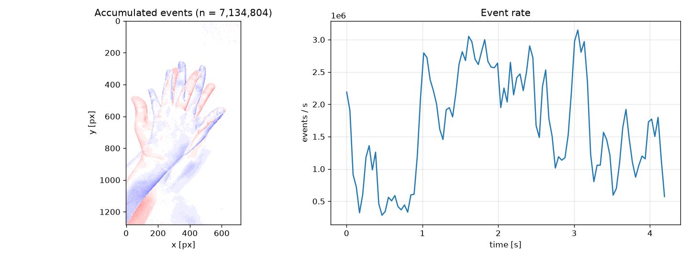

# ESIM (Python port): an event camera simulator

<p align="left">
  
  
  
  
</p>

[](https://github.com/lianeheidemann/rpg_esim_python_v2/actions/workflows/demo.yml)
[](https://github.com/lianeheidemann/rpg_esim_python_v2/actions/workflows/video-demo.yml)

*[Leia em Português](README_Pt-br.md)*

> Provenance: this code is a migration (from C++ to Python) and adaptation of the event-generation core of ESIM, originally published by Henri Rebecq, Daniel Gehrig, and Davide Scaramuzza (Robotics and Perception Group, University of Zurich) in "ESIM: an Open Event Camera Simulator" (CoRL 2018) — original repository at uzh-rpg/rpg_esim. The event-simulation model (the algorithm, contrast thresholds, refractory period, etc.) belongs to the original authors. The pure-Python rewrite, package structure, CLI, tooling (src/tools/), and tests are work done for this repository

<p align="left">
  
</p>
    
A pure-Python port of the event-generation core of [ESIM](https://github.com/uzh-rpg/rpg_esim), an open-source simulator for event cameras (DVS/DAVIS-class sensors). Given a folder of timestamped intensity images, it reproduces the original per-pixel event model — including threshold noise, the refractory period, and motion-blurred frame output — without any ROS, catkin, or C++ toolchain.

```bibtex
@Article{Rebecq18corl,
  author        = {Henri Rebecq and Daniel Gehrig and Davide Scaramuzza},
  title         = {{ESIM}: an Open Event Camera Simulator},
  journal       = {Conf. on Robotics Learning (CoRL)},
  year          = 2018,
  month         = oct
}
```

The paper is available [here](http://rpg.ifi.uzh.ch/docs/CORL18_Rebecq.pdf). If you use this code, please cite the publication above.

## What this is (and isn't)

This repository ports only the **event generation pipeline** of the original C++/ROS project — the part that turns a sequence of intensity images into events. It does **not** include the original's scene renderers (planar, panorama, OpenGL, UnrealCV), trajectory/IMU simulation, or ROS publishing/rosbag recording. If you need those, use the [original C++/ROS ESIM](https://github.com/uzh-rpg/rpg_esim) or the [GPU-accelerated Python bindings](https://github.com/uzh-rpg/rpg_vid2e), which wrap the same reference implementation.

In practice this means: **you supply the images** (rendered however you like, or a real video/photo sequence), and this tool simulates what an event camera would have seen.

## Features

- Faithful port of the C++ event model: log- or linear-intensity thresholding, separate positive/negative contrast thresholds (C+/C-), additive Gaussian noise on the thresholds, and a per-pixel refractory period
- Motion-blurred frame synthesis via a finite exposure time, alongside the event stream
- Simple folder-based input (`images.csv` + image files) and file-based output (`.npz` / `.txt` events, PNG frame sequence)
- A small, dependency-light Python API (`esim.EventSimulator`, `esim.CameraSimulator`) usable outside the CLI
- A visualization helper (`esim.viz`) to render the accumulated event image and event-rate plot
- Only NumPy, OpenCV, and Matplotlib as dependencies — no ROS, no compiled extensions, runs anywhere Python does (Windows, macOS, Linux)

## Architecture

```
images.csv + frames ──▶ FolderImageSource ──▶ EventSimulator ──▶ events.npz / events.txt
                                          └──▶ CameraSimulator ──▶ frames/ (blurred PNGs)
```

- **`FolderImageSource`** ([src/esim/data_provider.py](src/esim/data_provider.py)) reads a stamped image sequence from disk.
- **`EventSimulator`** ([src/esim/event_simulator.py](src/esim/event_simulator.py)) compares the (log-)intensity signal against the contrast thresholds per pixel and emits events, honoring threshold noise and the refractory period.
- **`CameraSimulator`** ([src/esim/camera_simulator.py](src/esim/camera_simulator.py)) integrates intensity over an exposure window to synthesize motion-blurred conventional frames.
- **`esim.cli`** ([src/esim/cli.py](src/esim/cli.py)) wires the three together into the `python -m esim.cli` command-line tool.
- **`esim.writers`** ([src/esim/writers.py](src/esim/writers.py)) and **`esim.viz`** ([src/esim/viz.py](src/esim/viz.py)) handle output I/O and visualization.

## Repository layout

| Path | Contents |
| --- | --- |
| [`src/esim/`](src/esim) | The simulator package: types, event/camera simulators, data provider, CLI, writers, visualization |
| [`src/tests/`](src/tests) | Unit and end-to-end tests (`unittest`) |
| [`src/tools/`](src/tools) | Standalone scripts: synthetic test-sequence generator, `images.csv` builder, video frame extractor |
| [`src/requirements.txt`](src/requirements.txt) | The three runtime dependencies |

## Requirements

- Python 3.8+
- `numpy`, `opencv-python`, `matplotlib` (see [src/requirements.txt](src/requirements.txt))
- Runs on Windows, macOS, and Linux — no ROS, catkin, vcstool, or C++ build tools needed
- Works inside a plain `venv` or a conda environment; nothing here requires conda specifically

## Installation

```bash
conda create -n esim python=3.10
conda activate esim
cd src
pip install -r requirements.txt
```

(A regular `venv` works identically — swap the first two lines for `python -m venv .venv` and activating it.)

All commands below (running the simulator, tools, tests) are meant to be run from inside `src/`.

## Preparing input

The simulator reads a folder containing an `images.csv` index and the image files it references:

```
seq/
├── images.csv
├── frame_000000.png
├── frame_000001.png
└── ...
```

`images.csv` has one `timestamp_ns,filename` pair per line (lines starting with `#` or `%` are comments):

```
# timestamp_ns, image
0,frame_000000.png
1000000,frame_000001.png
```

Two helpers are provided:

- **`tools/generate_stamps_file.py`** builds `images.csv` for a folder of images you already have, at a fixed frame rate:
  ```bash
  python tools/generate_stamps_file.py -i path/to/frames -r 1000
  ```
- **`tools/make_test_sequence.py`** renders a synthetic translating grating end to end — useful for a quick demo or for tests, since it produces a dense, predictable event stream:
  ```bash
  python tools/make_test_sequence.py --output demo_seq --frames 200
  ```
- **`tools/premiere_video.py`** extracts frames from a video file (`.mp4` and other OpenCV-decodable formats) and writes the matching `images.csv`:
  ```bash
  python tools/premiere_video.py -i video/video.mp4 -o video_input
  ```
  See [doc/converter_video.md](doc/converter_video.md) (in Portuguese) for the full video-to-event-frames walkthrough.

## Running the simulator

```bash
python -m esim.cli --input demo_seq --output demo_out --contrast-threshold 0.2
```

(The default contrast threshold of `1.0` is tuned for full-range renders; the synthetic demo grating above has a modest contrast, so a lower threshold like `0.2` is needed to actually trigger events. Tune it to match your own image sequence's contrast.)

Arguments can also be kept in a file and loaded with `@`, one flag per line (this mirrors the flagfiles the original C++ tool used):

```bash
python -m esim.cli @cfg/my_run.conf
```

### Flags

| Flag | Default | Description |
| --- | --- | --- |
| `-i`, `--input` | *(required)* | Folder containing `images.csv` and the images |
| `-o`, `--output` | *(required)* | Folder to write results into |
| `--contrast-threshold` | — | Set both C+ and C- at once (overrides the two below) |
| `--contrast-threshold-pos` | `1.0` | Positive (ON) contrast threshold, C+ |
| `--contrast-threshold-neg` | `1.0` | Negative (OFF) contrast threshold, C- |
| `--contrast-threshold-sigma-pos` | `0.0` | Std. dev. of Gaussian noise added to C+ |
| `--contrast-threshold-sigma-neg` | `0.0` | Std. dev. of Gaussian noise added to C- |
| `--refractory-period-ns` | `0` | Minimum time between two events at the same pixel |
| `--no-log-image` | off | Threshold raw intensity instead of log intensity |
| `--log-eps` | `0.001` | Epsilon added before the log, to stabilize dark pixels |
| `--random-seed` | — | Seed for the threshold noise (nondeterministic if unset) |
| `--exposure-time-ms` | `10.0` | Exposure time used to synthesize motion blur |
| `--no-blurred-frames` | off | Skip motion-blurred frame output entirely |
| `--no-txt` | off | Skip the `events.txt` export (still writes `events.npz`) |
| `--quiet` | off | Suppress progress output |

`--contrast-threshold-sigma-pos/neg` default to `0` here rather than the original's `0.021`, matching every configuration the original ESIM ships with: threshold noise starves the event stream when the per-frame intensity step is much smaller than the noise itself.

### Output

```
demo_out/
├── events.npz          # x, y, t (ns), pol — see esim.writers.load_events_npz
├── events.txt           # "t x y pol" per line, t in seconds (omit with --no-txt)
└── frames/              # blurred frames + images.csv (omit with --no-blurred-frames)
```

## Visualizing results

```bash
python -m esim.viz demo_out/events.npz
python -m esim.viz demo_out --save-to preview.png   # headless, writes a PNG instead of a window
```

This renders the accumulated event image (blue = net ON, red = net OFF) next to the event-rate-over-time curve.

<p align="left">
  
</p>

To convert `events.txt` into an event-frame sequence (blue = ON, red = OFF),
accumulating events in 10 ms windows:

```bash
python -m esim.event_frames demo_out/events.txt --output demo_out/event_frames --window-ms 10
```

This writes numbered PNGs plus an `images.csv` timestamp index. Use a shorter window
for finer temporal detail or a longer one to accumulate more events per image.

## Using it as a library

```python
from esim import EventSimulator, EventSimConfig, CameraSimulator

sim = EventSimulator(EventSimConfig(Cp=0.2, Cm=0.2, random_seed=0))
camera = CameraSimulator(exposure_time_ms=10.0)

for stamp_ns, image in my_image_sequence:       # image: 2D array in [0, 1]
    events = sim.image_callback(image, stamp_ns)  # structured array, esim.EVENT_DTYPE
    frame = camera.image_callback(image, stamp_ns)  # None until one exposure window is filled
```

## Running the tests

```bash
python -m pytest tests/ -q
```

## Acknowledgements

This is a port of [ESIM](https://github.com/uzh-rpg/rpg_esim) by the Robotics and Perception Group (University of Zurich). All credit for the underlying event-generation model goes to the original authors; see the citation above.

## License

Released under the MIT License. See [LICENSE](LICENSE).
