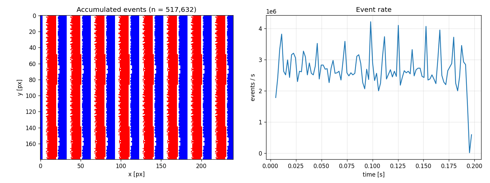

# Exemplo de saída

Esta pasta contém uma amostra da saída produzida pela sequência sintética descrita no README principal.

- `preview.png`: eventos acumulados e taxa de eventos ao longo do tempo.
- `events.txt`: arquivo completo de eventos em texto (`t x y pol`).
- `events.npz`: arquivo completo e compacto para carregamento com NumPy.
- `events_sample.txt`: primeiras 20 linhas do arquivo `events.txt` completo.



Para gerar a saída completa localmente:

```powershell
python tools/make_test_sequence.py --output demo_seq --frames 200
python -m esim.cli --input demo_seq --output demo_out --contrast-threshold 0.2
python -m esim.viz demo_out --save-to preview.png
```

As pastas `demo_seq/` e `demo_out/` permanecem ignoradas pelo Git porque podem conter centenas de frames e arquivos grandes.
